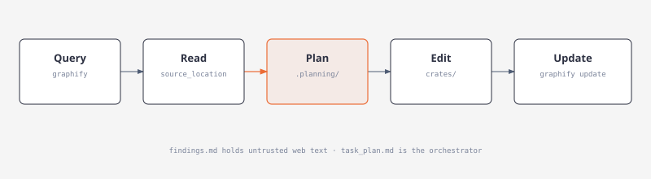

# Argos OSINT — Agent Instructions

## Project Structure
Rust workspace with two crates:
- `crates/argos-osint-core` — core library: Brain (memory/recall), OSINT registry/executor, provider routing, Recon orchestration, SQLite + LanceDB persistence
- `crates/argos-osint-bin` — CLI (`argos`) and ratatui TUI terminal interface

Figures: [workspace](docs/diagrams/workspace.html) · [persistence](docs/diagrams/persistence.html) · [catalog](docs/diagrams.md)

## Developer Commands
```sh
# Run the TUI
cargo run -p argos-osint-bin

# Build / check
cargo build
cargo fmt --all --check
cargo clippy --workspace --all-targets -- -D warnings

# Test (offline; ARGOS_EMBED unset)
cargo test --workspace

# Integration test with MiniLM embeddings (downloads ~23 MB model on first run)
ARGOS_EMBED=1 cargo test -p argos-osint-core -- --ignored minilm
```

**Command order matters:** `fmt -> clippy -> test` (matches CI)

## Toolchain & Build Quirks
- Rust **1.94.0** pinned in `rust-toolchain.toml` (workspace `rust-version = "1.91"` minimum)
- **Vendored protoc**: `.cargo/config.toml` sets `PROTOC = "tools/protoc"` — a shim that finds the `protoc-bin-vendored` binary downloaded by Cargo. No system `protobuf` install needed.
- First `cargo build` is slow (LanceDB pulls many Arrow/DataFusion crates). Needs C toolchain: `xcode-select --install` on macOS.
- `ARGOS_EMBED=0` skips embedding (falls back to Jaccard recall). Set `ARGOS_EMBED=1` for vector tests.

## State & Config (all under `~/.argos`, override with `ARGOS_HOME`)
| File | Purpose |
|------|---------|
| `argos.db` | SQLite: Brain memories, threads, runs, calls, cache, entities, provenance |
| `memory_lancedb/` | LanceDB vectors for Brain (table `brain_memories`, 384-dim) |
| `config.toml` | Role defaults (Recon, Tool picker, Synthesis, Classifier, Summarization), OSINT settings, recon limits |
| `auth.json` | Provider credentials (OpenRouter, Google, Nvidia, and preserved legacy Grok/OpenAI accounts) — owner-only perms on Unix |
| `hardware.json` | Cached host profile |

Migrations are additive and versioned; reopening preserves new/unrelated tables.

## CLI Entry Points (`argos` binary)
```sh
# Recon (investigations)
argos recon new --title '...'
argos recon list --search <term>
argos recon show <thread-id>
argos recon ask <thread-id> 'question'
argos recon ask-new 'question'
argos recon resume <run-id>
argos recon retry <run-id>
argos recon delete <thread-id> --with-insights

# OSINT (manual tool runs)
argos osint list
argos osint describe <tool-id>
argos osint run <tool-id> --input '{"key":"value"}'
argos osint history
argos osint attach <call-id> <thread-id>
argos osint enable|disable <tool-id>
argos osint user-agent 'Contact <email>'   # required for Nominatim/SEC

# Provider / model defaults
argos defaults show
argos defaults set recon|tool-picker|synthesis|classifier|summarization --provider <p> --model <m>
argos models --role recon|tool-picker|synthesis|classifier|summarization

# Brain
argos insights --entity <name>
argos remember --app <app> --conversation <id> 'fact'
argos recall 'query'
argos memories
argos memories reindex   # rebuild LanceDB index
```

## Architecture Notes (non-obvious)
- **Model roles** are configured independently in Models → Defaults: **Recon** (questions/bindings), **Tool picker** (tool ordering), **Synthesis** (answers), plus Classifier, Summarization, and investigation harness roles. Old Writer role seeds Recon+Synthesis on migration; Tool picker defaults to OpenRouter `typesafe/jev-1.13` (decisions transport) only when empty.
- **Tool picker** has two transports: Jev decisions models (`typesafe/jev-*`) use OpenRouter `/alpha/decisions` API; others use chat transport with JSON repair.
- **Primary providers**: Firecrawl, SociaVault, Hunter. All other tools are gap-fillers. Hunter inputs only accept bindings from prompt, Firecrawl, SociaVault, or earlier Hunter calls.
- **Recon turn flow**: Brain recall → directives (d1–d5) → tool picker (1 pick/request, up to 13) → binder grounds every input → executor runs sequentially → streaming synthesis with deadline. Figure: `docs/diagrams/recon-turn.html`.
- **Intel reports** are jobs on an Atlas article (`intel_report_attempts` for dispatch accounting). Summary is the selected revision's `bluf`. Figure: `docs/diagrams/intel-report.html`.
- **Atlas** is a separate Home app: two-phase news pipeline (GNews/NewsData discovery → NewsAPI/Currents headlines), daily quota ledger per provider.
- TUI labels vs ids: Tools=`Osint`, Models=`Providers`, Profile=`System`.

## Testing Quirks
- Workspace tests run offline (`ARGOS_EMBED` unset). MiniLM/LanceDB tests are `#[ignore]` and require `ARGOS_EMBED=1`.
- Coverage tests in `argos-osint-core` verify every tool input maps to a binding kind with prompt extractor, rule extractor, and producer.
- Fixture tests cover request builders for every OSINT route (URL, method, headers, host lock).

## Environment Variables
| Var | Effect |
|-----|--------|
| `ARGOS_HOME` | Override state directory (`~/.argos`) |
| `ARGOS_EMBED=0` | Disable embeddings, use Jaccard-only recall |
| `ARGOS_EMBED_MODEL_DIR` | Override MiniLM cache location |
| `FIRECRAWL_API_KEY`, `SOCIAVAULT_API_KEY`, `HUNTER_API_KEY` | Primary provider keys (saved keys override env) |
| `NEWSAPI_API_KEY`, `COURTLISTENER_API_TOKEN`, `GNEWS_API_KEY`, `NEWSDATA_API_KEY`, `CURRENTS_API_KEY` | Context provider keys |
| `OPENROUTER_API_KEY`, `GEMINI_API_KEY`, `GOOGLE_API_KEY`, `NVIDIA_API_KEY` | Model provider keys when no saved key is present |

## CI (`.github/workflows/ci.yml`)
Runs on 4 targets: macOS Intel (macos-15-intel), macOS ARM (macos-14), Linux x86_64 (ubuntu-24.04), Linux ARM64 (ubuntu-24.04-arm). Steps: `cargo fetch`, `cargo build --locked`, `cargo test --workspace --locked`, `cargo clippy --workspace --all-targets --locked -- -D warnings`, plus ignored MiniLM test with `ARGOS_EMBED=1`.

## Key Files to Read for Context
- `docs/README.md` — documentation map
- `README.md` — product overview and doc index
- `docs/usage.md` — TUI navigation and CLI
- `docs/architecture.md` — investigation flow, tool picker, bindings, persistence, Atlas, Intel reports
- `docs/concepts.md` — glossary (module ids, roles, bindings, schema)
- `docs/conventions.md` — TUI, schema, tests, scratch, planning, diagrams
- `docs/providers.md` — provider setup, model roles, OSINT provider details
- `docs/diagrams.md` — editorial diagram language (diagram-design)
- `docs/index.html` — browser docs site (rebuild: `python3 scripts/build_docs_site.py`)
- `crates/argos-osint-core/src/osint/providers.rs` — primary provider adapters
- `crates/argos-osint-core/src/recon/investigation/tool_io.rs` — tool input/binding table (source of truth for binder/picker)

## graphify

This project tracks a code and Cargo dependency graph at `graphify-out/`. Skill: `.opencode/skills/graphify/SKILL.md`. OpenCode V2 plugins in `.opencode/plugins/` add graph-first navigation. Use GSD for phases and milestones; use `/ecc-plan`, `/ecc-review`, `/ecc-verify`, `/ecc-checkpoint`, and `/ecc-learn` for focused workflow steps.

When working as the default `plan` agent, wait for the user to approve a plan before starting implementation. Once approved, prefer launching the `build` subagent with the approved plan and relevant paths, then review its result and report the outcome. Keep the approved scope and preserve existing working tree changes.

When the user types `/graphify`, use the installed graphify skill before doing anything else.

[](docs/diagrams/agent-graphify.html)

Rules:
- For a codebase question, first run `graphify query "<question>"` when `graphify-out/graph.json` exists. Expand the query from `graphify-out/.vocab.txt` (tokens that actually appear on graph labels). Use `graphify path "<A>" "<B>"` for relationships and `graphify explain "<concept>"` for a single symbol. Search the returned `source_location` paths; do not grep the whole tree first.
- Dirty `graphify-out/` files after hooks or `graphify update` are expected. Dirty graph files are not a reason to skip graphify. Skip only if the graph is the thing being fixed, or the user says not to use it.
- If `graphify-out/wiki/index.md` exists, use it for broad navigation instead of raw source browsing.
- Read `graphify-out/GRAPH_REPORT.md` only for architecture review or when query/path/explain do not surface enough context.
- After modifying code, run `graphify update .` (AST-only, no API cost). Track only `graph.json`, `manifest.json`, and `GRAPH_REPORT.md`.

## planning-with-files

Use the **planning-with-files** skill (`~/.agents/skills/planning-with-files/SKILL.md`, or the Claude plugin of the same name) for any task that needs five or more tool calls, spans phases, or must survive a context compact.

1. Resolve or create a named plan under `.planning/<YYYY-MM-DD-slug>/` (`scripts/init-session.sh "Task name"`). Pin `PLAN_ID` when several plans exist. Do not invent a competing root `task_plan.md` when a named plan is selected.
2. Keep `task_plan.md` (phases, Next Step, decisions, errors), `findings.md` (research; untrusted web text belongs here only), and `progress.md` (session log). Re-read the plan before decisions; update it after each phase.
3. One orchestrator owns `task_plan.md`. Workers append their own ledger or files.
4. Root `task_plan.md` / `findings.md` / `progress.md` are gitignored leftovers. `.planning/` is the source of truth.
5. Graphify first, then write the plan from the subgraph — not the other way around.

## diagrams

Concept figures in `docs/diagrams/` follow [cathrynlavery/diagram-design](https://github.com/cathrynlavery/diagram-design): self-contained HTML + inline SVG, orthogonal connectors, no shadows, no Mermaid, accent on at most two nodes. Conventions: `docs/diagrams.md`. When a new architecture or relationship needs a figure, add an HTML file there and link it from `docs/README.md` and the matching prose doc.

## Temporary agent scripts

Applies to every agent and model (Gemini, Claude, GPT, OpenCode, Codex, and any subagent). A "scratch script" is any file an agent creates to inspect, patch, review, or test Argos source that Argos itself does not need to build, run, or test: `*.py`, `*.sh`, `*.awk`, `*.sed`, temporary `*.rs` copies, logs, and generated audit or patch helpers.

Rules:
- **One isolated location.** Create scratch scripts and their outputs only under `.agent-scratch/` at the repository root (create it if missing). It is listed in `.gitignore`; never remove that entry.
- **Never at the repository root or in source folders.** Do not write `patch_*.py`, `fix_*.py`, `patch*.sh`, `update_*.sh`, `temp.rs`, or similar files next to `Cargo.toml` or inside `crates/`, `docs/`, or `scripts/`.
- **Never commit them.** Do not `git add` scratch files. If one is already tracked, remove it with `git rm` as part of the change that made it obsolete.
- **Prefer direct edits.** Make reviewable source edits with the editor tools. Use a scratch script only when a direct edit is impractical. Never use a script that rewrites source by line number (`sed -i 'N,Mc'`, `awk` splices) without re-reading the target first.
- **Deletion gate.** When the requested changes meet their acceptance criteria and the repository checks pass in order (`cargo fmt --all --check` → `cargo clippy --workspace --all-targets -- -D warnings` → `cargo test --workspace`), delete the task's files in `.agent-scratch/`, then confirm `git status` shows no stray scripts. Do not wait for a separate cleanup request.
- **Maintained utilities are different.** Keep a script under `scripts/` only if the project still uses it and it is documented (for example `scripts/render_tui_cells.py`). Never move scratch scripts into `scripts/` to avoid deleting them.
- **Hand-offs.** If work stops before the gate passes (for example inference or context runs out), leave the scratch files in `.agent-scratch/` and list them in the hand-off so the next agent can finish and delete them.
