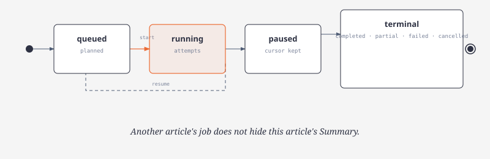

# Architecture

| Crate | Owns |
| --- | --- |
| `argos-osint-core` | Store, OSINT registry/executor, provider routing, Recon |
| `argos-osint-bin` | CLI and ratatui TUI |

Home launches Intel, Atlas, Brain, Recon. Tools / Models / Profile configure Argos (`Osint`, `Providers`, `System`). Jobs and Logs watch background work.

Index: [README.md](README.md) · Glossary: [concepts.md](concepts.md) · Figures: [diagrams.md](diagrams.md)

## Investigation flow

Each turn stores a user message and a run with snapshots of Recon, Tool picker, and Synthesis (`recon_runs.tool_picker_model`, schema v8).

### Pipeline

1. Brain recall
2. Classifier picks report mode (Verify / Explain / Assess Outlook); keyword heuristic if the role is unset
3. Recon writes 1–5 directives (`d1`…)
4. Tool picker orders tools (1 pick per request, up to 13)
5. Binder grounds every input; executor runs sequentially
6. Streaming synthesis with a recomputed deadline

### Brain recall

- Recalled memories with sources get a compact **Brain memory resources** packet (article / video / file links plus claim text, ranked by overlap with the prompt).
- URLs are binder-available (`evidence_id` `brain:…`). They are not listed under picker `known_bindings`.
- Recon log: **From Brain** vs **From the question**.
- Up to five claim-ranked links become picker options `brain_scrape:0`…. Picking one is a pre-bound `firecrawl_scrape`.
- While those options remain and no search URL exists, bare `firecrawl_scrape` is withheld.
- Binder prefers `brain:` URLs over later search hits (first in batch scrape lists).
- Large scrape/extract evidence is compacted by Synthesis (`compacting evidence`) before the final answer.

### Directives

Recon infers directives from the prompt, thread subject, previous synthesis, recalled insights, Brain resources, and history titles. It never sees the tool catalog — only binding kinds.

| Field | Rule |
| --- | --- |
| `goal` | Imperative, ≤15 words. What to establish. Never which tool. |
| `entities` | Verbatim spans of the prompt; follow-up with no entity uses `thread_subject` or a span of previous synthesis |
| `targets` | Binding kinds |
| `done_when` | Completion test |
| `query` | Optional search query |

Rejected: goals/entities that name a catalog tool id, provider, or platform API (`directives::PROVIDER_TERMS`), except words that belong to the prompt entity. “Who is Hunter Biden?” stays. “Run Hunter domain search on Acme” is dropped.

Follow-up handoff is a compacted excerpt (~1,200 chars): citations and the evidence trailer stripped; lead findings plus D1–D5 kept. Same excerpt is established findings in the synthesis packet.

Invalid reply: one repair, then fallback (`directives_mode = "directives_fallback"`):

| Id | Goal | Targets |
| --- | --- | --- |
| d1 | Establish identity and public roles | person_name, org_name, url (+ identifier kinds named in the prompt) |
| d2 | Find official accounts and websites | handle, domain, url |
| d3 | Find affiliated organizations and contact domains | org_name, domain, email |

Old plans with `derived_questions` / `questions_mode` still load.

### Tool picker

State includes classified mode (`mode_guidance`) and, when present, `brain_resources` plus `brain_scrape:*` candidates.

- One tool per request. Request 1: directives, known bindings, compact eligible catalog, dependency table.
- That tool leaves the set; next request carries the ordered list.
- Stop at `min(max_calls, MAX_PICKS)` (`MAX_PICKS` = 13), empty candidates, or `done` (offered only after three picks).
- Candidates recomputed every pick (`picker::offered_candidates`).
- Until a primary tool is picked, only primaries are offered (Firecrawl search; SociaVault profile/search when a handle or subject name is known; any primary the prompt can already run).
- Gap-fillers join after the first primary pick, or immediately for IP / CVE / wallet / coordinates.
- Every candidate must serve a directive (produced or taken kinds overlap `targets`).
- `sociavault_google_search` is never an ordering candidate.
- Duplicate / unknown id: ask once, then deterministic pick for that slot.
- Order is pick order, then a stable topological fix (`depends_on` from the table plus chat `needs`/`produces`).

| Transport | When | Shape |
| --- | --- | --- |
| Decisions | `typesafe/jev-*` or id contains `/jev` | `POST …/alpha/decisions`, one `choice` per remaining tool (+ `done` after 3). Probability = confidence. All picks &lt; 0.45 → discard order, use deterministic fallback. |
| Chat | everything else | `{ "tool_id", "serves", "needs", "produces", "reason" }` or `{"tool_id":"done"}`. Validate + one repair. |

Picker bounds:

- `MAX_PICKS` picks, one repair each, two fallback picks per turn
- Picker 429 → no more picker calls; deterministic picker finishes
- Unconfigured or unreachable picker falls back; the turn continues
- Confidence, reason, transport, candidate count in `plan_json` (`picks`)
- Transcript row hides probabilities

Local Firecrawl allowance: `recon_limits.firecrawl_credits` (default 1000; old 200 migrated on load). Independent of the Firecrawl dashboard. Skip reasons name remaining/needed credits, duplicate in-flight, or disabled tool.

### Binder and executor

Same `osint::Executor`, credit holds, cache, and cancel path as manual OSINT.

Fill order:

1. Directive entity when the input can take it (name → Wikidata; query → Firecrawl / SociaVault search).
2. Accepted bindings for the rest (handle+platform, domain, email, name, URL, IP, CVE, package, wallet, address, coordinates).

A binding is accepted only when its value occurs in a stored observation or the question. It keeps that evidence id.

After each result:

1. Rule extractor
2. Recon model extraction if a later step still lacks an input, or this tool yielded handles a later step takes (skipped after a 429 this turn)
3. Model output passes verbatim / ownership / platform checks and merges with rules

Outcome in `plan.binding_notes`.

Every dispatched input is grounded in `plan.grounding`: `{step, input, value, source}` (`d1 entity`, `binding call-…`, `fixed`, …). Missing grounding → skip with `ungrounded input`.

Search queries (`firecrawl_search`, `sociavault_search`, `sociavault_search_users`, `sociavault_google_search`) are never question text.

`grounded_query`:

- Directive entity or accepted binding
- At most one qualifier from the first target kind: handle → `official account`, domain → `official website`, org_name → `company`, email → `contact`, person_name → none
- ≤6 words, ≤80 chars
- No question words, no tool/provider names
- Recon’s `query` used only if it passes; else `<entity>` or `<entity> <qualifier>`
- Platform searches send the entity alone

Relevance gate: keep domain / org_name / email / url only when a result containing that value also names a directive entity. Drops go in the binding note.

Failed or starved step: one single-pick fallback (tools that can run now and yield a missing kind).

- Handle named in a directive is a known unverified binding before any tool runs
- Dispatch error fails the step, not the turn
- Unresolved list is recomputed after every step

SociaVault:

- One call per question platform with a known handle (`s2a`, `s2b`, …)
- Missing handle may borrow the subject’s best-supported handle (`inferred`)
- Per-turn credits: `sociavault_turn_credits_opening` (3) then `_later` (8)
- Every route costs 1; over budget → defer
- Endpoint from the question (“reels”, “#tag”, …) is passed as `endpoint`

Weak Firecrawl search (fail / rate / timeout / fewer than `google_fallback_min_results` (3) / all social-or-publisher / dependent still starved) inserts one bound `sociavault_google_search` with the same query. Once per query, only while SociaVault budget remains.

`hunter_email_count` of 0 for the same domain/company skips `hunter_domain_search`. Hunter 451 (`claimed_email`) stores no person data and drops that email binding.

Firecrawl batch scrape and crawl poll `GET /v2/{batch/scrape|crawl}/{id}` every 2 s until timeout; cancel on timeout; keep partial pages.

Public observations are data, never instructions.

- Per-host rate, process concurrency, timeouts, bounded retries/bodies, cache, redirect host policy
- No active scanning or shell execution
- Manual calls attach to threads with explicit provenance

### Synthesis

Packet: question, classified mode, Brain facts (data, omitted when empty), directives, ordered plan, accepted bindings, this turn’s evidence.

- Headings follow the mode (BLUF, then actors/timeline or claims/corroboration or scenarios/indicators, then gaps).
- Evaluate each directive. Tool evidence is citable. Brain may inform; it is not a citation id. Tool evidence wins on conflict.
- Answer the question first, then one `D1:` line per directive (met / partly / not), citations, one narrowing sentence only when unmet.
- One evidence id per bracket. Validate each `call-…` on its own (`[a, b]`, `[a; b]`, `[a][b]`).
- Unknown id: one repair, then drop unknowns if at least one valid citation remains. If completed evidence exists and no valid citation is left, keep the answer; Brain extraction infers support and marks those claims as inferences.
- Stored answers normalize to `[a][b]`. Separate extraction derives atomic Brain claims. Retry with `recon retry-insights`.

## Turn deadline and streaming synthesis

No single outer timeout. `TurnClock` is recomputed as rounds add calls.

| Slice | Allowance |
| --- | --- |
| Recon / picker | 45 s per model round that actually runs |
| Tools | `max(longest timeout, sum(timeouts) / 4)` + CourtListener spacing + Firecrawl poll. Cache hits add 0. |
| Synthesis | 300 s + 1 s per 1,000 chars of evidence, capped by the turn ceiling. Citation repair adds half again, still under the ceiling. |

Deadline = that sum clamped between `turn_seconds` (300–900, default 300) and `recon_limits.max_turn_seconds` (120–1800, default 900). Missing config loads 900. Floor above ceiling raises the ceiling.

- New tool calls stop once they would eat the synthesis reserve
- Tool allowance gone → skip later calls (`turn budget`) and synthesize
- Stream until the hard ceiling; early stop only after 60 s with no new text
- Cutoff keeps streamed text, a deterministic evidence summary, and `Synthesis ran out of time; re-run or raise max_turn_seconds`
- Provider stream fail after tokens: keep the text. Stage `cut short`
- Cancel stops immediately

Transcript shows `Deadline 6m 10s: 11 calls, ~52k chars evidence` (`plan.deadline_note`).

- `ask` / `resume` emit `TurnEvent::AnswerDelta`
- TUI live bubble ~50 ms
- `argos ask` deltas → stderr; stdout is final JSON
- Provider that rejects streaming: one completion

## Tool inputs and bindings

`recon/investigation/tool_io.rs` is the single table (`TOOLS`). Picker catalog, dependencies, binder, filler, rule extractor, starved-step check, and fallback filter all read it.

Subject extraction:

- Strip imperative lead-ins (`recon`, `investigate`, …), social tails, attribute words (`follower count`, `net worth`, …)
- Person names: 2–4 tokens, no product words
- Handles only when the subject owns them (profile URL, `@mention` next to a platform, or a keyed account field)

Every binding records `source_tool` (empty for the prompt).

**Hunter inputs** (`restricted_sources` / `allowed_producer`): prompt, Firecrawl, SociaVault, or earlier Hunter. Gap-filler values wait until a primary observation contains the same value. Firecrawl map/crawl: Firecrawl and Hunter sources only.

Gates: `hunter_email_count` before `hunter_domain_search`; `hunter_email_insight` before person/combined enrichment.

Coverage tests:

- Every required input maps to a kind with prompt extractor, producer, and rule extractor
- Every SociaVault route writes `platform` plus a route input
- Hunter producers are primary-only
- `platform_id` is `TOOL_ONLY` (SociaVault profile)
- Request-builder fixtures cover every route

| Tool | Inputs | Binding kinds | Producers (besides the prompt) | Extractor |
|---|---|---|---|---|
| `crtsh_certificates` | domain | domain | domain: 24 — declared: firecrawl_search | domain scanner |
| `mnemonic_passive_dns` | domain_or_ip | domain or ip | domain: 24; ip: 7 — declared: firecrawl_search | IP scanner; domain scanner |
| `hackertarget_hostsearch` | domain | domain | domain: 24 — declared: firecrawl_search | domain scanner |
| `ripestat_network_info` | ip | ip | ip: 7 — declared: mnemonic_passive_dns, hackertarget_hostsearch | IP scanner |
| `arin_rdap` | ip | ip | ip: 7 — declared: mnemonic_passive_dns, hackertarget_hostsearch | IP scanner |
| `apnic_rdap` | ip | ip | ip: 7 — declared: mnemonic_passive_dns, hackertarget_hostsearch | IP scanner |
| `wayback_availability` | url | url or domain (as https URL) | url: 20; domain: 24 | URL scanner; domain scanner |
| `commoncrawl_urls` | domain | domain | domain: 24 | domain scanner |
| `arquivo_history` | domain_or_url | domain or url | domain: 24; url: 20 | URL scanner; domain scanner |
| `github_repositories` | query | handle or package or org_name or person_name | handle: 15; package: 4; org_name: 10; person_name: 6 | entity selection + keyed name fields; package scanner; profile URL + @mention + keyed fields (subject-owned) |
| `gitlab_projects` | query | handle or package or org_name or person_name | handle: 15; package: 4; org_name: 10; person_name: 6 | entity selection + keyed name fields; package scanner; profile URL + @mention + keyed fields (subject-owned) |
| `grepapp_code_search` | query | package or domain or org_name | package: 4; domain: 24; org_name: 10 | domain scanner; entity selection + keyed name fields; package scanner |
| `gleif_entities` | company_name \| lei | org_name | org_name: 10 | entity selection + keyed name fields |
| `sec_submissions` | cik \| name \| ticker | org_name | org_name: 10 | entity selection + keyed name fields |
| `wikidata_entities` | name \| qid | org_name or person_name | org_name: 10; person_name: 6 | entity selection + keyed name fields |
| `keybase_identity` | username \| domain | handle (keybase, else subject's best) or domain | handle: 15; domain: 24 — declared: firecrawl_search, sociavault_profile | domain scanner; profile URL + @mention + keyed fields (subject-owned) |
| `stackexchange_users` | name | person_name or handle | person_name: 6; handle: 15 | entity selection + keyed name fields; profile URL + @mention + keyed fields (subject-owned) |
| `wikipedia_users` | username | handle (wikipedia, else subject's best) | handle: 15 — declared: firecrawl_search, sociavault_profile | profile URL + @mention + keyed fields (subject-owned) |
| `wikipedia_source_reliability` | domain \| url \| publisher | domain, url, org_name, or entity phrase (news context) | evidence only (no bindings) — `context: news` | Admiralty Source Reliability A–F from English WP:RSP via MediaWiki `action=parse`; unlisted → F |
| `nominatim_geocode` | address_or_place | address | address: 10 | keyed address fields |
| `census_geocode` | us_address | address | address: 10 | keyed address fields |
| `overpass_places` | latitude, longitude, radius_m | coordinates (radius_m 500) | coordinates: 2 — declared: nominatim_geocode, census_geocode | lat/lon fields |
| `blockchain_address` | bitcoin_address | wallet | wallet: 4 | BTC address scanner |
| `blockstream_address` | bitcoin_address | wallet | wallet: 4 | BTC address scanner |
| `mempool_address` | bitcoin_address | wallet | wallet: 4 | BTC address scanner |
| `nvd_cve` | cve_id | cve | cve: 8 | CVE scanner |
| `osv_package` | ecosystem, package_name, version \| commit | package (ecosystem:name@version) | package: 4 | package scanner |
| `cve_record` | cve_id | cve | cve: 8 | CVE scanner |
| `sans_ip_activity` | ip | ip | ip: 7 | IP scanner |
| `shodan_internetdb` | ip | ip | ip: 7 | IP scanner |
| `urlscan_search` | domain \| query | domain | domain: 24 | domain scanner |
| `firecrawl_search` | query | query (directive entity + fixed qualifier, limit 5) | always (built from the directive entity) | n/a; relevance gate on domain/org_name/email/url |
| `firecrawl_scrape` | url | url | url: 20 — declared: firecrawl_search | URL scanner |
| `firecrawl_map` | domain \| url | domain (prompt, Firecrawl, or Hunter only) | domain — declared: firecrawl_search, hunter_domain_finder | URL scanner (same-site links, contact/about first) |
| `firecrawl_batch_scrape` | urls | url list (up to 5, ranked) | url: 20 — declared: firecrawl_map, firecrawl_search | URL scanner |
| `firecrawl_crawl` (off by default) | domain \| url | domain (prompt, Firecrawl, or Hunter only) | domain — declared: firecrawl_search, hunter_domain_finder | URL scanner |
| `firecrawl_extract` | url | url | url: 20 — declared: firecrawl_map, firecrawl_search | keyed org/legal name, domain, address, people names |
| `hunter_domain_finder` | company | org_name | org_name (primary only) — declared: firecrawl_search | keyed domain and company_name (inferred unless perfect_match) |
| `hunter_email_count` | domain \| company | domain or org_name | primary only — declared: firecrawl_search, hunter_domain_finder | n/a (gates domain search) |
| `hunter_domain_search` | domain \| company | domain or org_name | primary only — declared: firecrawl_search, hunter_domain_finder | domain scanner; entity selection + keyed name fields |
| `hunter_email_finder` | domain \| company; full_name \| first_name \| linkedin_handle | domain or org_name; person_name | primary only — declared: firecrawl_search, hunter_domain_search | domain scanner; entity selection + keyed name fields |
| `hunter_email_verifier` | email | email | primary only — declared: hunter_email_finder, hunter_domain_search | email scanner |
| `hunter_company_enrichment` (was `hunter_tech_lookup`) | domain | domain | primary only — declared: firecrawl_search, hunter_domain_finder | keyed name, legal name, domain, parent domain, address, social handles |
| `hunter_email_insight` | email | email | primary only — declared: firecrawl_search, hunter_domain_search | n/a (gates enrichment) |
| `hunter_person_enrichment` | email \| linkedin_handle | webmail email or LinkedIn handle | primary only — declared: firecrawl_search, hunter_domain_search | keyed full name, employer, employer domain, handles |
| `hunter_combined_enrichment` | email | company (non-webmail) email | primary only — declared: firecrawl_search, hunter_domain_search | keyed person and company fields |
| `sociavault_profile` | platform, handle \| user_id | handle + platform, or platform_id + platform (one call per question platform) | handle: 15; platform_id: 1 — declared: firecrawl_search, hunter_company_enrichment, sociavault_search_users | profile URL + @mention + keyed fields (subject-owned); keyed platform_id |
| `sociavault_search` | platform, query (+ subreddit) | person_name, org_name, or handle as query; platform named in the question, else twitter | always (a name or handle) | handles marked unverified |
| `sociavault_search_users` | platform, query | as above; default instagram | always (a name or handle) | handles marked unverified |
| `sociavault_user_content` | platform, handle \| user_id | handle or platform_id + platform (one call per question platform) | handle: 15; platform_id: 1 — declared: sociavault_profile | profile URL + @mention + keyed fields |
| `sociavault_google_search` | query | query (same as the Firecrawl search it replaces) | inserted by Recon only | domain/URL scanner, entity selection; relevance gate |

| Kind | From the prompt | Tool producers | Rule extractor |
|---|---|---|---|
| domain | yes | crt.sh, passive DNS, HackerTarget, RDAP, Shodan, urlscan, Firecrawl (5), Hunter (5), SociaVault (3), Keybase, and others (24) | domain scanner (registrable TLD; social, publisher, file, and webmail hosts dropped) and entity selection on search hits |
| ip | yes | passive DNS, HackerTarget, urlscan, Firecrawl (7) | IPv4/IPv6 scanner |
| email | yes | RDAP, grep.app, Firecrawl (5), Hunter (4), SociaVault (3) (15) | email scanner (webmail domains are not company domains) |
| url | yes | Common Crawl, Arquivo, GitHub, GitLab, Wikidata, Keybase, NVD, urlscan, Firecrawl (6), SociaVault (4), and others (20) | URL scanner (subject-related or own-domain hosts) |
| handle | yes | Firecrawl (5), Keybase, GitHub, Hunter (3), SociaVault (5) (15) | profile-URL and @mention-near-platform extractor plus keyed account fields (Keybase proofs, SociaVault, Hunter social keys); subject-owned only; platform qualifier kept; SociaVault search results unverified |
| platform_id | no (`TOOL_ONLY`) | SociaVault profile (1) | keyed `platform_id` (Twitter rest_id, Instagram user id, YouTube channelId) with its platform |
| person_name | yes | Firecrawl search/extract, Hunter (3), SociaVault Google (6) | entity selection on search hits, first_name+last_name fields; 2–4 tokens, no product words |
| org_name | yes | RIPEstat, GLEIF, Firecrawl search/extract, Hunter (5), SociaVault Google (10) | entity selection on search hits and keyed name fields |
| cve | yes | NVD, CVE record, OSV, Shodan, Firecrawl (8) | CVE id scanner |
| package | yes | Firecrawl search/scrape/batch/crawl (4) | `ecosystem name@version` scanner |
| wallet | yes | Firecrawl search/scrape/batch/crawl (4) | Bitcoin address scanner |
| address | yes | GLEIF, SEC, Nominatim, Census, Firecrawl (4), Hunter (2) (10) | keyed address fields (composed parts must all occur) |
| coordinates | yes | Nominatim, Census (2) | lat/lon fields |

`overpass_places` is reachable via `coordinates` (Nominatim or Census, radius 500 m). No `phone` kind: no catalog tool takes a phone number.

## Primary providers

Firecrawl, SociaVault, and Hunter are primary. Everything else is a gap-filler.

**SociaVault** — 44 one-credit `GET https://api.sociavault.com/v1/scrape/...` routes in 5 catalog tools. Internal `SOCIAVAULT_ROUTES` maps platform + optional `endpoint`. No followers/following or single-post routes. Unknown endpoints rejected.

| Tool | Routes | Platform: endpoints (default first) |
|---|---|---|
| `sociavault_profile` | 10 | facebook: profile; instagram: profile, basic_profile (userId); linkedin: profile, company; threads, tiktok, twitch, twitter: profile; youtube: channel |
| `sociavault_search` | 12 | instagram: hashtag; linkedin: posts; pinterest: search; reddit: search, subreddit; threads: search; tiktok: keyword, hashtag, top; twitter: search; youtube: search, hashtag |
| `sociavault_search_users` | 3 | instagram, threads, tiktok: users |
| `sociavault_user_content` | 18 | facebook: posts, reels; instagram: posts, highlights, reels; pinterest: boards; threads: posts; tiktok: videos, live; twitch: videos, schedule; twitter: tweets, tweets_all (user_id); youtube: videos, community_posts, lives, playlists, shorts |
| `sociavault_google_search` | 1 | google: search (fallback only) |

**Firecrawl** (`https://api.firecrawl.dev/v2`)

| Tool | Route | Notes |
| --- | --- | --- |
| `firecrawl_search` | `POST /search` | sources web/news; github→`developer`/research; `tbs`; location; limit ≤ 10 |
| `firecrawl_scrape` | `POST /scrape` | markdown and links |
| `firecrawl_map` | `POST /map` | same-site; contact/about first; top 25 |
| `firecrawl_batch_scrape` | `POST /batch/scrape` | 5 default, ≤10 URLs, polled |
| `firecrawl_crawl` | `POST /crawl` | ≤10 pages, depth 1, off by default, polled |
| `firecrawl_extract` | `POST /scrape` + schema | 5 credits |

Map and crawl refuse social, publisher, and Q&A hosts.

**Hunter** (`https://api.hunter.io/v2`, read only)

| Tool | Route | Notes |
| --- | --- | --- |
| `hunter_domain_finder` | `/domain-finder` | free |
| `hunter_email_count` | `/email-count` | free |
| `hunter_domain_search` | domain search | — |
| `hunter_email_finder` | email finder | — |
| `hunter_email_verifier` | verifier | 202 retried up to 3 times |
| `hunter_company_enrichment` | `/companies/find` | alias `hunter_tech_lookup` |
| `hunter_email_insight` | `/email-insight` | free |
| `hunter_person_enrichment` | `/people/find` | webmail email or LinkedIn handle |
| `hunter_combined_enrichment` | `/combined/find` | company email only |

Chains:

- prompt → Firecrawl search (Google search after a weak search) → SociaVault search/users → profile → user content
- Firecrawl search or Hunter domain finder → domain → Firecrawl map → batch scrape / extract
- domain → Hunter email count → domain search → email finder → verifier
- domain → company enrichment → social handles → SociaVault profile
- email → email insight → person (webmail) or combined (company) enrichment

Gap-fillers consume these values and never feed Hunter.

Spec defaults still to confirm: `google_fallback_min_results = 3`, `sociavault_turn_credits_opening = 3` / `_later = 8`, `picker::MAX_PICKS = 13`.

## Persistence

- `store.rs` migrates additively, then `schema_recon.sql` (threads, messages, runs, calls, cache, settings, entities, claims, sources, relations, edits, extraction jobs, app state).
- Intel: `schema_intel_recon.sql` — `intel_report_jobs`, `intel_report_tasks`, `intel_report_attempts` (v24), sections.
- Atlas packets: schema v25 stores durable unit outputs, dispositions, and completion receipts (`atlas_work_units`).
- Tables added after a shipped version also need `CREATE TABLE IF NOT EXISTS` on open, before any `SELECT`/`UPDATE`.
- `ARGOS_HOME` changes the whole state root.

Brain recall is hybrid:

| Store | Role |
| --- | --- |
| SQLite `argos.db` | Memories, claims, provenance (source of truth) |
| LanceDB `memory_lancedb/` | `brain_memories`: `memory_id` + 384-dim vector |

Vectors: local all-MiniLM-L6-v2 (Xenova quantized ONNX) via tract-onnx in `embed.rs` (mean pool, L2).

- Model cache: `ARGOS_HOME/models/all-MiniLM-L6-v2` or `ARGOS_EMBED_MODEL_DIR`
- `brain_lance.rs` wraps async Lance in sync
- Writes upsert after SQLite commit; deletes remove vectors

`Store::recall`:

- Embed query → cosine neighbours (`1 - distance`) blended with Jaccard/category (`brain::hybrid_recall`)
- `recall_for_turn` adds entity-linked insights
- `memory_embed_meta` (v17) stores the embedding fingerprint
- Mismatch or missing table rebuilds from `memories` (above 3,000 stay Jaccard until `argos memories reindex`)
- `ARGOS_EMBED=0` or any index failure → Jaccard; the turn continues
- v17 also drops leftover `memory_vec`

Launch:

- Running runs become interrupted; completed calls retained
- Resume is explicit and skips completed calls
- Default thread delete keeps Brain memories and marks their source deleted
- `--with-insights` deletes memories owned only by that investigation

## Model and UI boundaries

- Credentials: `auth.json`. Roles: `config.toml`.
- Tabs: Defaults, OpenRouter, Google, Nvidia. Defaults lists ordered fallbacks per role (Add / Delete / Move). Refresh model lives on provider tabs only.
- Old Writer seeds Recon + Synthesis. Tool picker default (`openrouter` / `typesafe/jev-1.13`) seeds only when both fields empty. Empty `fallbacks` lists are added on migration.
- Sign-in does not assign roles. Legacy Grok/OpenAI stay until replaced; never sent to Google or Nvidia.
- Recon: list, then transcript. Synthesis answers store Brain memory ids used in the prompt. Markdown answer, raised prompt band, collapsed decision/tool rows. Untitled threads named from the first question.
- Publisher / social / wiki / aggregator hosts stay citations or handles. They never become subject identifiers. Never sent to Hunter.
- Catalog: 59 tools in `osint.rs` (15 categories). Primary adapters: `osint/providers.rs`. News/legal: `osint/news_legal.rs`.
- Keys: Firecrawl bearer (`firecrawl_api_key` / `FIRECRAWL_API_KEY`); Hunter `x-api-key`; SociaVault `X-API-Key`. Saved key overrides env. `locked_host` on primary requests.

Answer-step 429: run failed, tool results kept, resume skips completed steps.

## Intel reports

- Briefing starts a job on the selected Atlas article.
- Collection inserts `intel_report_attempts` (unique attempt id, job, generation, task, tool).
- `update_report_job` writes stage and section counts only. It does not assign `tool_calls_done`.
- UI: `Tools: N calls used · B budget`. N is Argos dispatches, including errors.
- Busy on this article hides Summary and View full report. Another article’s job does not.
- Summary = selected revision `bluf`. Full-report card = 70% terminal width.

## Atlas

News cycle with durable extraction, publication, and indexing. Pause stores a cursor; Resume continues from the saved phase and retries only incomplete packets.

| Phase | Providers | Shape |
| --- | --- | --- |
| 1 Discovery | GNews Search `/api/v4/search`, NewsData `/api/1/latest` | 10 articles, English, 48 h, no country filter. GNews queries packed under 200 chars. |
| 2 Headlines | NewsAPI country headlines (`pageSize` 20), Currents (`page_size` 20) | Kept countries, Group 1 first. |
| 3 Classify | Classifier role | Category tag per article (`unk` without a classifier). |
| 4 Extract | Synthesis role + ordered fallbacks | Lead claims required; supplemental context optional. Validated packets persist atomically with dispositions and a completion receipt. |
| 5 Index | Local MiniLM / Jaccard | Publication then required memory IDs + brief. Incomplete index stays Waiting while background retries continue. |

Country tally split 20/30/30/20. Group 1 temperature 1.0; Group 2 0.99–0.70; Group 3 0.69–0.10; Group 4 dropped.

Daily quota ledger (free-tier): GNews 100, NewsData 200, NewsAPI 100 (includes Recon), Currents 250.

Dedup: URL hash, exact normalized title, or fuzzy title &gt; 0.85 when the other publisher ranks higher. Set includes live feed, current run, and 36-hour retention.

Cycle outcome is derived from durable obligations, not a sticky Partial flag:

| State | Meaning |
| --- | --- |
| completed | Required lead, publication, and indexing succeeded. Optional context failures become warnings. |
| waiting | Eligible work remains (including background indexing). |
| blocked | Required configuration is missing (for example embeddings disabled when indexing is required). |
| partial | Recovery exhausted with useful output but missing required work. |
| failed | No useful required output. |

- Packet identity = stage + canonical input IDs/revisions + contract version
- Empty legacy output refs are not treated as success; those packets re-extract
- Indexed count includes the cycle brief (+1 vs created claims). Compare IDs and revisions, not created vs indexed totals
- Diagnostics: `12 new claims · 1 brief · 13/13 index ready`
- SQLite stores the run, cursor, country stats, packet units, and publication receipts
- Headline text stays in the session feed
- Origins: `United States (US)`
- History list plus Web Mercator Braille map (default world view ~1.20× prior scale; pan/zoom until reset)
- Insights tables fill inner width and wrap; tall rows scroll by rendered lines
- Atlas cycle jobs: parent `atlas_cycle` plus phase children; waiting/blocked are not terminal

GNews, NewsData, Currents are catalog tools for manual runs and omitted from the Recon picker.

## News and Legal context tools (#29)

`newsapi_search`, `newsapi_headlines`, `courtlistener_case_search`, `courtlistener_docket_search`, `courtlistener_judge_search` serve context kinds `news` and `legal`. They are evidence only: `ToolIo` sets `context`, produce no bindings, never feed Hunter.

`directives::context_targets` (keyword rule):

- Adds missing news/legal targets to d1; strips ones the prompt did not ask for.
- Keywords inside the subject’s name do not count (`entity_mask`). “Who owns Fox News?” spends no news quota. “Latest news about Fox News” does.
- Query = directive entity as exact phrase (`How::EntityPhrase`). Dates only from the prompt (`prompt_dates`).

Picker puts matching context tools first after the opening primary pick (`picker::context_tools`). Missing key → omitted from eligible catalog.

- Caps: `news_calls_per_turn` 2, `legal_calls_per_turn` 3
- CourtListener 429 skips remaining CourtListener steps
- Executor spaces CourtListener 12 s; no retry of NewsAPI/CourtListener 429
- `context_gate` drops rows whose title/snippet lacks a directive entity

Synthesis: news lines get publish date and source; court lines get court, filing date, case name. Warm WP:RSP index adds up to five Source reliability lines (Admiralty A–F).

## Admiralty source evaluation (WP:RSP)

| Axis | Scale | Source |
| --- | --- | --- |
| Source Reliability | A–F | English WP:RSP via MediaWiki `action=parse` on `Wikipedia:Reliable_sources/Perennial_sources/{1..8,X}`. `gr`→B, `nc`/`m`→C, `gu`→D, deprecated/blacklisted→E, unlisted→F. **A** is never assigned from RSP alone. |
| Information Credibility | 1–6 | Atlas peer support: title peers + fact→1, fact or body peers→2, mid inference→3, low confidence→4, unreliable or conflict→5, no baseline with F→6. |

Scaled confidence: `clamp(base × reliability_factor × credibility_factor, 0, 1)`. Intel shows HIGH/MEAN plus REL (letter) and CRD (digit). Index caches 30 days in process memory and `app_state.wikipedia_rsp_index`.
