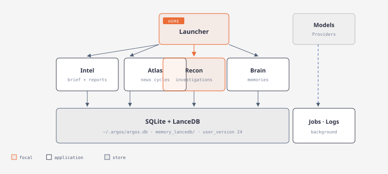
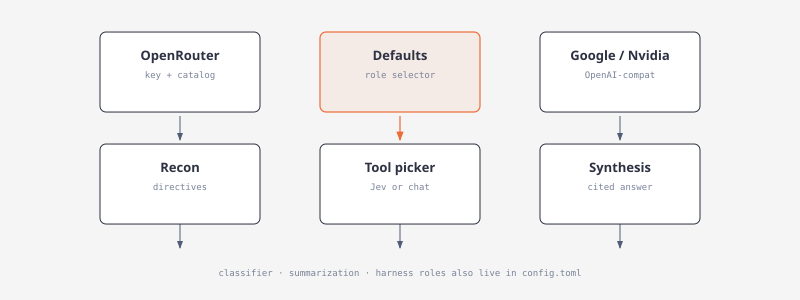
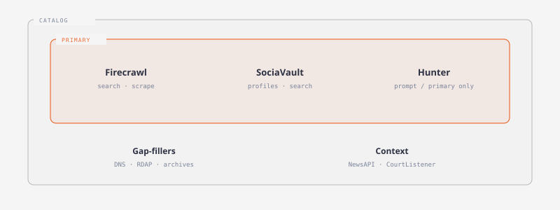
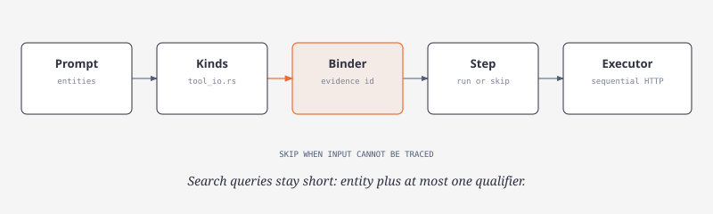
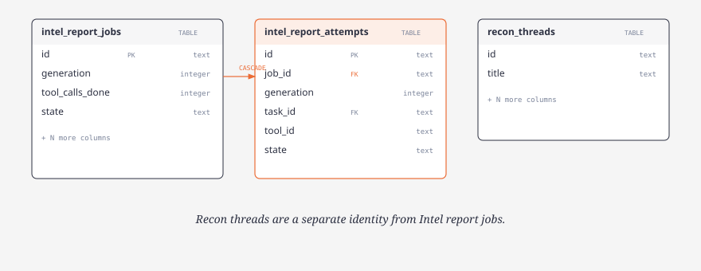

# Concepts

Short names used across the TUI, CLI, and store. Source of truth for investigation mechanics is [architecture.md](architecture.md).

## Apps and internal IDs

Home launches nine surfaces. Labels on screen differ from `ModuleId` values; keep the IDs unless a migration requires otherwise.

| Label | `ModuleId` | Kind |
| --- | --- | --- |
| Intel | `Intel` | Application |
| Atlas | `Atlas` | Application |
| Brain | `Brain` | Application |
| Recon | `Recon` | Application |
| Jobs | `Jobs` | System |
| Logs | `Logs` | System |
| Tools | `Osint` | System |
| Models | `Providers` | System |
| Profile | `System` | System |

Only Recon has a composer. Intel Briefing starts a **report job** on an Atlas article; that is not a Recon investigation thread.

## Model roles

Each role is provider + model in `config.toml`. Accounts live in `auth.json`. Saving a key does not change a role.

| Role | Job |
| --- | --- |
| Recon | Directives and bindings |
| Tool picker | One next tool per request (Jev decisions or chat JSON) |
| Synthesis | Cited answer |
| Classifier | Recon report mode from the prompt |
| Summarization | Graph/path summaries |
| Evidence curator, Entity resolver, Claim assessor, Investigation controller | Investigation harness |

Legacy Grok/OpenAI accounts remain until the user assigns a replacement. New setup tabs are Defaults, OpenRouter, Google, Nvidia.

## Primary OSINT providers

Firecrawl, SociaVault, and Hunter are primary. Everything else is a gap-filler. Hunter inputs come only from the prompt, Firecrawl, SociaVault, or earlier Hunter calls.

## Bindings

A binding is a typed value (`domain`, `handle`, `url`, …) with an evidence id. `recon/investigation/tool_io.rs` maps every catalog input to a kind, a prompt extractor, a rule extractor, and producers. Ungrounded inputs skip the step.

## Intel report jobs

Durable job on one Atlas article (`intel_report_jobs`). Dispatches are rows in `intel_report_attempts` (created on open at schema 24 if missing).

| UI | Meaning |
| --- | --- |
| `Tools: N calls used · B budget` | N = Argos dispatches including errors. Cache reuse and validation skips are not calls. |
| Summary | Selected revision `bluf` |
| View full report | 70%-width card of all sections |

Busy work on this article hides Summary and the launch control. Another article’s job does not.

## Persistence

- SQLite `~/.argos/argos.db` (`ARGOS_HOME`), `user_version` 24, additive migrations
- LanceDB `memory_lancedb/` (384-dim MiniLM)
- `ARGOS_EMBED=0` → Jaccard recall

## Graph

`graphify-out/graph.json` is the code graph. Query it before broad search. After code edits, `graphify update .`. Track `graph.json`, `manifest.json`, and `GRAPH_REPORT.md` only.
