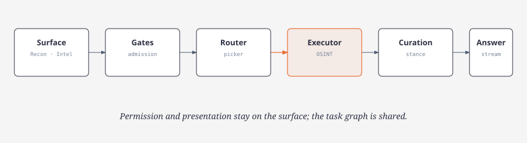

# Argos OSINT — Unified Investigation Harness

## Overview

The Unified Investigation Harness provides a shared, incremental, evidence-driven execution pipeline used across:
- **Recon Chat** (direct interactive multi-turn investigations)
- **Home Composer** (fast launcher with immediate session allocation)
- **Intel Briefing & Jobs** (systematic multi-section background reports)

The harness preserves surface-specific presentations, permission restrictions, and persistent database identities while unifying the underlying task scheduling, catalog governance, tool routing, evidence curation, and model execution.

## Architecture

Surfaces keep their own UI and stored ids. Admission gates, the picker, the executor, evidence curation, and synthesis are shared. See [architecture.md](architecture.md) for Recon turn mechanics.

---

## 9 Logical Model Roles & Inheritance

Model defaults are configured under **Providers → Defaults** or `/models`. Nine distinct logical roles govern the lifecycle of an investigation:

| Logical Role | Purpose | Default Inheritance |
|--------------|---------|---------------------|
| `recon` (Planner) | Query decomposition, directive formulation, task dependencies | Root default |
| `tool_picker` | Picks next eligible tool and binding arguments | OpenRouter Jev (`typesafe/jev-1.13`) |
| `synthesis` | Produces structured assessments, final briefing, executive answers | Root default |
| `classifier` | OSINT taxonomy classification and tag assignment | OpenRouter Jev (`typesafe/jev-1.13`) |
| `summarization` | Compresses evidence passages, produces grounded views | Inherits `synthesis` |
| `evidence_curator` | Extracts source-linked passages, observations, and temporal dates | Inherits `recon` |
| `entity_resolver` | Resolves cross-platform identities and entity conflicts | Inherits `classifier` |
| `claim_assessor` | Evaluates claim verification, stances, and citations | Inherits `synthesis` |
| `investigation_controller`| Verifies checkpoints, stopping conditions, and task dispatch | Inherits `recon` |

### Inheritance Rules
1. When a derived role (such as `evidence_curator` or `claim_assessor`) has an empty provider/model assignment in `config.toml`, it automatically inherits from its designated parent.
2. An explicit configuration immediately overrides inheritance.
3. Inheritance cycles are rejected.
4. Changing defaults applies to future tasks; in-flight tasks preserve their snapshotted assignments.

---

## 3-Level Tool Catalog & 14 Intelligence Categories

All 59 catalog tools map into 14 authoritative intelligence categories:

1. **Web Discovery** (`firecrawl_search`, `firecrawl_crawl`, `sociavault_google_search`, etc.)
2. **News & Events** (`gnews_search`, `newsdata_latest`, `newsapi_everything`, `currents_search`, etc.)
3. **Publisher Context** (`wikipedia_search`, `wikipedia_page`, `wikidata_entity`, etc.)
4. **Legal & Litigation** (`courtlistener_dockets`, `courtlistener_opinions`, etc.)
5. **Corporate & Organizations** (`sec_edgar_company`, `sec_edgar_filings`, `opencorporates_search`, etc.)
6. **Professional Identity** (`hunter_domain_search`, `hunter_email_verifier`, `hunter_technologies`, etc.)
7. **Social Content** (`sociavault_twitter_user`, `sociavault_instagram_user`, `sociavault_reddit_post`, etc.)
8. **Public Account Corroboration** (`github_user`, `github_repo`, `huggingface_model`, etc.)
9. **Domain & Infrastructure** (`whois_lookup`, `dns_lookup`, `shodan_host`, `crtsh_certs`, etc.)
10. **Historical Web** (`wayback_available`, `wayback_timemap`, `commoncrawl_index`, etc.)
11. **Software & Code** (`github_code_search`, `npm_package`, `pypi_package`, etc.)
12. **Geography & Places** (`nominatim_search`, `overpass_query`, `geonames_postal`, etc.)
13. **Bitcoin & Blockchain** (`blockchain_address`, `blockchain_tx`, etc.)
14. **Vulnerabilities & Cyber** (`cve_lookup`, `nvd_cve`, `alienvault_otx`, etc.)

*Note: `hunter_tech_lookup` is an authoritative alias resolving to `hunter_technologies`.*

### 3-Level Catalog Projection
- **Level 1 (Compact Capabilities)**: Lightweight descriptions, cost, prerequisites, and limitations for Planner and Controller prompt context.
- **Level 2 (Picker Candidates)**: Task-specific candidate list with prerequisite binding status and expected contributions.
- **Level 3 (Argument Contract)**: Concrete JSON schema, route builder, and retry guidance for the selected tool.

---

## Validation Gates & Scarce Provider Protections

Investigations are guarded by five deterministic validation gates:

1. **Task Admission Gate**: Verifies surface eligibility, prevents duplicate tasks, and validates dependency graphs.
2. **Tool Preflight Gate**:
   - **Atlas Encapsulation**: Atlas-only news discovery tools (`atlas_gnews`, `atlas_newsdata`, `atlas_currents`, `atlas_newsapi`) are strictly forbidden in Recon Chat and Intel.
   - **SociaVault Protection**: `sociavault_google_search` requires **both** weak Firecrawl discovery and an unmet evidence need. Weak Firecrawl alone cannot authorize SociaVault credit expenditure.
   - **Platform-Native Gate**: Specialized platform tools require an unmet platform-native need.
3. **Evidence Admission Gate**: Ensures every curated passage possesses an authoritative URL/domain, retrieval timestamp, and substantive quote/facts.
4. **Claim Assessment Gate**: Strict claim-specific evidence isolation. An unrelated supporting passage for entity B can never validate a claim about entity A. Contradictions are explicitly preserved.
5. **Publication Gate**: Verifies that every assertion in the final briefing is grounded in admitted evidence passages.

---

## Reasoning Channel Separation & Collapsed Thinking

Argos enforces strict channel separation between model reasoning and answer content across all providers (Grok, OpenAI, OpenRouter, and Local):

1. **No Reasoning Promotion**: Reasoning/thinking output is never promoted to answer text or treated as evidence. If a model returns only reasoning without answer content, it is classified as an empty completion requiring bounded repair.
2. **Separate Streaming**: Answer tokens and reasoning tokens flow through distinct channels (`on_delta` vs `on_reasoning`).
3. **Collapsed Default Display**:
   - In the TUI, thinking rows appear as compact summaries:
     `▶ Thinking… · {role} · {model} · {timestamp}`
   - Users can expand any attempt row via Enter or click.
   - `/thinking` toggles global thinking disclosure without affecting model reasoning effort.
   - `/details` toggles directive and tool payload disclosure without exposing thinking.

---

## Chronological Trace & Persistence

All activity is recorded in SQLite schema version 20:
- `investigation_tasks`: Granular task execution states (`pending`, `executing`, `completed`, `failed`, `blocked`, `cancelled`).
- `investigation_task_dependencies`: Directional task prerequisite edges.
- `investigation_evidence_passages`: Deduplicated evidence quotes with entity bindings and stance tags.
- `investigation_claim_assessments`: Claim-specific verdicts (`verified`, `refuted`, `inconclusive`, `insufficient_evidence`).
- `investigation_events`: Chronological trace of gates, tool calls, and transitions with secret redaction.
- `investigation_stream_parts`: Durable attempt streams for crash recovery and resumable execution.
