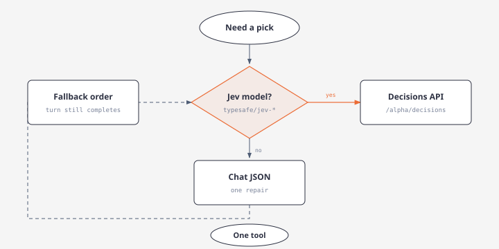

# Argos Adaptive Decision Roles and Strict Output Contracts

## Overview

Argos supports capability-adaptive decision role integration, enabling finite classification, discrete tool selection, and semantic validation gates across Recon chat and Intel brief analysis.

A single canonical **`DecisionContract`** is compiled into either:
1. **Jev-native questions** (`typesafe/jev-1.13` via OpenRouter `POST /alpha/decisions`), or
2. **Compact schema-constrained prompts** for general models (`StrictJsonSchema`, `JsonMode`, or `ValidatedText`).

Application code enforces deterministic surface restrictions, budget caps, credentials, and recovery policies. Generative models continue planning, query decomposition, and narrative synthesis.

---

## Authoritative 12-Template Registry

All 12 decision points share the canonical contract compiler:

| Template | Role | Instruction Focus | Allowed Outcomes |
|---|---|---|---|
| `mode` | `classifier` | Which deliverable does the request require? | `verify`, `explain`, `assess_outlook`, `full_assessment`, `ambiguous` |
| `directive_alignment` | `investigation_controller` | Does candidate.objective advance task.objective for this subject? | `aligned`, `unrelated`, `insufficient` |
| `tool_selection` | `tool_picker` | Which eligible candidate best supplies task.required_evidence? | Candidate Tool IDs, `no_match`, `insufficient` |
| `scarce_provider_need` | `investigation_controller` | Is distinctive provider evidence needed beyond retained evidence? | `necessary`, `unnecessary`, `insufficient` |
| `evidence_relevance` | `evidence_curator` | Does this passage address the intended subject and directive? | `relevant`, `wrong_subject`, `unrelated`, `insufficient` |
| `extraction_fidelity` | `evidence_curator` | Is the proposed observation faithful to the cited passage? | `faithful`, `unsupported_addition`, `material_omission`, `insufficient` |
| `entity_binding` | `entity_resolver` | Does supplied evidence establish the intended identity? | `same_entity`, `different_entity`, `ambiguous` |
| `claim_relation` | `claim_assessor` | How does the exact passage bear on the claim qualifiers and time scope? | `supports`, `contradicts`, `mentions_only`, `irrelevant`, `insufficient` |
| `handoff_adequacy` | `investigation_controller` | Are material findings, uncertainty, and unfinished work preserved? | `adequate`, `omission`, `unsupported_addition`, `insufficient` |
| `next_action` | `investigation_controller` | Which offered task best closes the remaining gap? | Task IDs, `request_replan`, `defer`, `insufficient` |
| `resolution` | `investigation_controller` | Is the required answer established, disputed, incomplete, or blocked? | `resolved_supported`, `resolved_disputed`, `needs_evidence`, `blocked`, `insufficient` |
| `publication` | `claim_assessor` | Is the conclusion faithful to assessed evidence and uncertainty? | `faithful`, `overstated`, `contradictory`, `insufficient` |

---

## State Isolation & Prompt Hardening

The state builder (`DecisionState`) isolates untrusted evidence passages as passive data rather than instructions:

- **`task`**: Identifier, revision, objective, required evidence, completion criteria.
- **`subject`**: Confirmed bindings and known ambiguity sets.
- **`candidate`**: Action, observation, binding, handoff, or conclusion under evaluation.
- **`evidence`**: Source IDs and verbatim passages with qualifications.
- **`computed_checks`**: Authoritative freshness, schema validations, eligibility, and budget facts.
- **`missing_context`**: Explicit known omissions.

Source content is strictly quoted inside the state payload. Prompt injection payloads embedded in retrieved evidence cannot modify criteria or approved labels.

---

## Execution Adapters

The adapter resolver inspects the configured provider and model to select the appropriate compiler:

- **`NativeDecisions`**: Dispatches directly to OpenRouter `POST /alpha/decisions` with typed `choice`, `noul`, or `score` questions. Never sent through `/chat/completions`.
- **`StrictJsonSchema`**: Configures OpenAI-compatible structured outputs ensuring exact required properties with no extra keys.
- **`JsonMode`**: Enforces `response_format: {"type": "json_object"}` and validates response locally against the schema.
- **`ValidatedText`**: Formats a minimal JSON-only instruction and applies strict local AST parsing.

---

## Threshold Policy & Uncertainty

Each decision evaluates against a `ThresholdProfile`:
- **Winning Probability**: Minimum probability (default 0.50) required for affirmative approval.
- **Distribution Margin**: Minimum margin (default 0.10) between top-1 and top-2 candidate probabilities.
- **Abstention Handling**: Selection of `insufficient`, `ambiguous`, or `no_match` yields `EnforcementOutcome::Uncertain`.
- **Approval Rule**: Only `EnforcementOutcome::Pass` constitutes approval. `Uncertain` and `Unavailable` never grant automatic progression.

---

## TUI Display & Trace

- **Providers → Defaults**: The "Decision & Analytical Roles" pane displays the active model, inheritance chain, and resolved adapter (`native_decisions`, `strict_json_schema`, etc.).
- **Live Trace**: Renders `"Deciding… · <model> · <gate>"` during execution, followed by `"Decision · 
 [<outcome>] · <model>"`.
- **Thinking UI**: Jev has no generated thinking tokens; no synthetic thinking blocks are created. General model reasoning remains in collapsed thinking sections without contaminating decision JSON.
