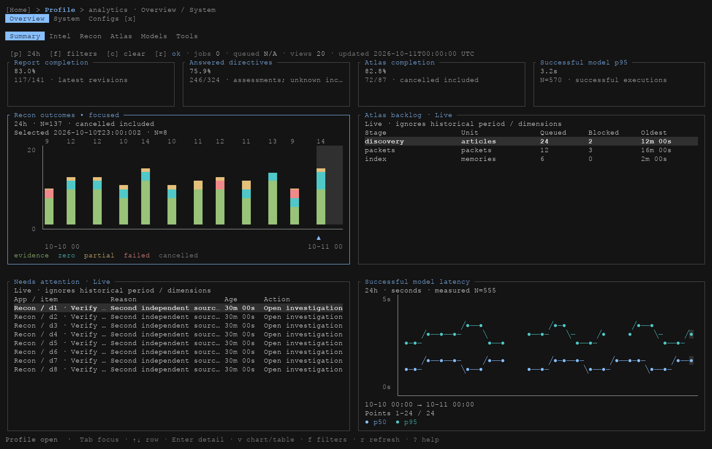
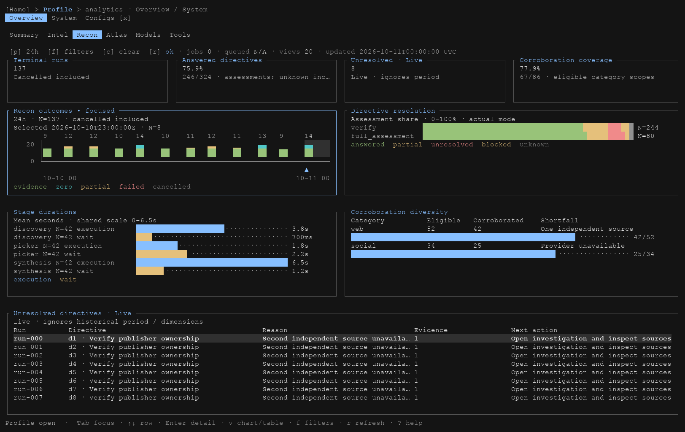
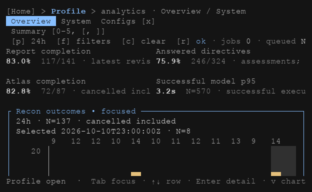

# Profile TUI implementation session — 2026-10-10

This record documents the process used to implement, test and verify the Profile analytics handoff, then establish the [reusable repo workflow](tui-verification.md). Screenshots below reconstruct actual ratatui TestBackend buffers from deterministic fixtures. They are not live provider sessions or conceptual mockups. The original handoff was `ARGOS_PROFILE_ANALYTICS_DASHBOARD_SPEC.md`; approved Summary/Recon reference PNGs were unavailable locally, so visual review assessed the written contract. The maintained product contract is [profile-analytics-dashboard.md](profile-analytics-dashboard.md).

## Scope and starting evidence

The working tree was initially clean. The agent read the handoff, queried the tracked graph, then read the TUI design contract, component catalog and relevant code. Planning-with-files maintained `.planning/2026-10-10-profile-analytics/{task_plan,findings,progress}.md`; one root agent owned that plan. The task continued through user steering and context recovery using those files.

The implementation preserved exactly 20 primary view IDs: Intel 4, Recon 5, Atlas 3, Models 4, Tools 4. Summary reused these views; Needs attention remained outside the primary inventory. System/Configs, theme tokens, scheduler ownership and existing persistence contracts were preserved. No migration was added and no commit was requested.

Before editing, the agent named **AnalyticsCard, TimePlot, DetailTable, Meter and ScrollPane**, and the **Dashboard/Report** presets. The shared geometry contract was `profile_layout::LayoutResult`; draw, focus and pointer targets consumed the same rectangles. Shared presentation went into `profile_components` rather than independent per-screen implementations.

## Ownership and implementation

Disjoint work kept integration predictable:

| Owner | Files and responsibility |
| --- | --- |
| Root | `profile.rs`, `profile_layout.rs`, new `profile_components.rs`, shared `components.rs`, `app.rs`, `ui.rs`, `mod.rs`; integration, fixtures and validation |
| Chart/metrics worker | `profile_charts.rs`, core `profile_stats.rs`; chart scales/colors, metric cohorts and rollups |
| Documentation worker | Design/component/product/usage docs and existing agent instruction files |

Children received chosen components, preset, owned files, read-only references and acceptance checks. The parent did not edit worker-owned files while workers ran. Workers reported results; the parent ran the final gates. This ownership describes the session, not a requirement to delegate every future TUI task.

The root implemented fixed shell rows, simultaneous two-column panels at wide sizes, single-column virtual scrolling below the threshold, compact KPIs at 60×18, a too-small notice, independent panel/report offsets and approximately 90% expanded reports. Interaction work covered logical focus reveal, row/bucket mouse targets, sorting, chart/table toggles, provider folding, custom timezone-aware date ranges, stale data retention, stable selection across refreshed rows and authoritative owner actions.

The chart/core work separated sends from terminal operations, queue/execution latency, quota from concurrency/pace, live backlog from historical cohorts, and raw from retained rollup coverage. Charts used shared scales, fractional stacks, signed temperature points, stable semantic colors, duration gaps and suppressed low-N p95. Missing historic identities or timings stayed N/A instead of being guessed. Attention items were bounded and carried authoritative owner/provenance IDs; draw remained free of SQL/network calls.

## Fixture and screenshot construction

`analytics_fixture` constructed dense but deterministic snapshots: 24 time buckets, 140 tool rows for scrolling, eight unresolved directives, quota scopes, fractional/signed series, low sample counts and missing durations. Fixture capture time was corrected to `2026-10-11T00:00:00Z` so all plotted hourly samples fell within the selected period and KPI cohorts agreed. Recon modes were corrected to actual `verify`/`full_assessment` values.

`analytics_viewports_and_data_states` rendered Summary, Intel, Recon, Atlas, Models, Tools, Intel detail and a low-sample Models report at 160×50, 120×40, 100×32, 60×18, 80×24, 40×20 and 100×24. Four additional stale/empty/loading/System cases yielded **60 JSON dumps**. Each preserved cell symbols/colors and selected modifiers. The separate `dump_cells` helper exports bold and underline; future exporters should retain both.

`ARGOS_SCREEN_DIR` enabled opt-in export from the test. The parent validated every dump's dimensions and rendered PNGs with `scripts/render_tui_cells.py`. Pillow was installed in an isolated `.agent-scratch/` environment. The renderer used platform monospace fonts and geometric box/block/diagonal/folding glyphs to avoid platform-font gaps; theme RGB colors remained the source. Rendering did not substitute a designed approximation of the UI.

The root opened all six wide dashboards and selected medium, minimum, too-small, report and data-state images. All 60 artifacts were generated and dimension-checked; not every PNG received a separate visual inspection. The durable examples below are copied from the final reviewed fixture output. Duplicate full galleries and completed task plans were removed after this record consolidated the findings. Regenerate all 60 cases with the [capture workflow](tui-verification.md#capture-actual-cells); no old planning directory is required.

## Screenshot evidence

The wide Summary exposes reused views and attention rows within the written 160×50 shell/panel contract:

Recon shows simultaneous outcome, resolution, stage, corroboration and unresolved panels. The selected bucket and semantic legends remain visible; canonical modes and sample counts describe the actual fixture cohort:

Wide [Atlas](screenshots/profile-analytics-2026-10-10/profile-atlas-160x50.png), [Models](screenshots/profile-analytics-2026-10-10/profile-models-160x50.png) and [Tools](screenshots/profile-analytics-2026-10-10/profile-tools-160x50.png) were also reviewed for scales, KPI coverage, labels and panel geometry.

At the minimum, the dashboard becomes a compact, scrollable single-column view; this checks reachability rather than assuming wide composition can fit:

The [40×20 below-minimum view](screenshots/profile-analytics-2026-10-10/profile-summary-40x20.png) retains navigation and an explicit notice. The [stale view](screenshots/profile-analytics-2026-10-10/profile-stale-160x50.png) retains prior values while reporting refresh failure. The [80×24 detail report](screenshots/profile-analytics-2026-10-10/profile-report-80x24.png) provides a constrained-width table/readout. Static images alone do not prove scrolling, refresh or owner actions.

## Defects found and corrected

| Evidence | Finding | Correction and regression coverage |
| --- | --- | --- |
| Wide KPI/panel review | Long values and stage labels clipped useful numeric/sample information | Shared KPI measured value lines, shorter actual stage labels, full report detail retained |
| Chart review | Glyph boxes on the macOS font obscured partial blocks/diagonals/folding indicators | Renderer font fallback/geometric glyph support; raw cells remained authoritative |
| Metric/fixture comparison | Fixture capture time and invented modes misrepresented visible cohorts | Fixed timestamp window and canonical mode values; regenerated artifacts |
| Scroll/focus tests | Repeated focus reveal could reset manual page scrolling; wheel focus could move the offset | Clamp-only normal drawing, explicit focus reveal, retain same-panel wheel state |
| Sort/selection tests | Draw rows and interaction rows could use different order | Shared ordered rows and stable row keys across refresh/sort |
| Missing/low-N checks | Detail p95 readout could disagree with suppression in the plot | Same N/A semantics in detail and chart |
| Full offline suite | Three rollup fixtures exposed hourly `YYYY-MM-DDTHH` parsing without minutes/seconds | Add explicit `:00:00`; preserve assertions; parser regression and 18 Profile snapshot tests passed |
| Owner action test | Provider action needed exact provider/quota scope, not just provider text | Match owner and quota ID, retain selected row and reveal it; focused exact-scope test passed |
| Mouse/keyboard parity test | Focused fold action needed Enter activation | Enter dispatch uses the focused action; extended folding test passed |

These findings led to the repo rule that visual, interaction and metric evidence are complementary. The hourly parser defect was caught by metric tests, not by screenshot appearance; the glyph/KPI defects were visible in PNGs; the final fold control required keyboard/mouse tests.

## Gate results and environment handling

The parent followed **fmt → Clippy → test**, with locked dependencies, no default features, `ARGOS_EMBED` unset and isolated `ARGOS_HOME`. The initial sandbox suite could not bind local mock-server sockets. The agent requested the required escalation and reran; that environmental failure was not counted as a product defect.

After the hourly parser correction, focused Profile snapshot tests passed **18/18**. A full offline workspace run passed **163 binary, 709 core and 3 integration tests** (875 total), with eight intentionally ignored tests. The subsequent binary suite including the new exact quota-scope test passed **164 tests**. The last interaction-only fold edit passed formatting, strict workspace Clippy and focused folding plus exact-scope tests. The record distinguishes these follow-ups from the earlier full-suite source rather than silently assigning a new aggregate result to it.

The strict gate used `cargo fmt --all --check`, `cargo clippy --workspace --all-targets --locked --no-default-features -- -D warnings`, and `cargo test --workspace --locked --no-default-features`. Actual mock-socket access was authorized. Approved reference-image comparison, live providers, default-feature LanceDB and MiniLM were not verified.

After checks, `graphify update .` completed with 7,976 nodes and 20,559 edges. SQL extraction warned about unavailable `tree_sitter_sql`; community labels were automatically renamed without an LLM refresh. Only the three prescribed tracked graph files changed. `git diff --check` passed. Task fragment files, Pillow environment and task cache were removed; cells, PNGs and planning evidence were retained. No commit was made.

## Standardization follow-up

The user then requested this process for all agents. The repo now carries a maintained procedure, shared `argos-tui-verify` skill, OpenCode `/tui-verify` command and `scripts/tui_review.py`. The new tool automates fresh capture, isolation, structural checks, rendering and provenance, while leaving review pending for actual inspection. Agent/ECC instructions route to the same guide instead of copying a large evolving checklist.

OpenCode setup checks also exposed an old configuration/test mismatch: legacy `agent` configuration interpreted permissions as request-body options in the installed V2 runtime. The follow-up uses supported `agents`/`request.body` fields, preserves model/reasoning settings, applies the already-documented plan/build restrictions and adds only the new skill to the allowlist. `/ecc-verify` now carries the required offline flags. Runtime diagnostics and repo tests validate this separately from the earlier product implementation.

The follow-up passed all nine OpenCode/tooling tests and skill frontmatter validation. End-to-end fresh capture produced 60 dumps/PNGs byte-identical to the original final artifacts; wide/minimum Summary images were reopened. Existing-output and zero-fixture filters correctly failed, and malformed/empty dump validation was tested. The initialized isolated OpenCode server registered `argos-tui-verify` at the canonical repo path and `tui-verify`; effective permissions and reasoning settings were inspected without making model calls. Immediate standalone catalogs were empty during startup, and large diagnostic listings were truncated by the CLI; bounded decoding on the initialized server resolved verification. Rust source did not change during standardization, so the earlier full Rust gate was retained; formatting and the actual fixture test were rechecked.

## Artifact retention

The cleanup retained the contracts, fixture/interaction/metric tests, two reusable Python tools, shared skill/command, this results record and its nine referenced PNG examples. Completed task plans, three duplicate full galleries, negative-check output, dated generated graph backups, an empty reflection report and an unreferenced `.sql.orig` backup were removed. The actual schema remains unchanged. The current tracked graph and extraction cache remain useful for agent navigation; unrelated product documentation and project/GSD context retain their own purpose. Future captures are temporary review evidence until their useful findings are consolidated; they are not permanent implementation dependencies.
