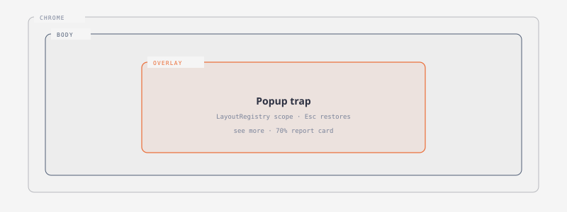
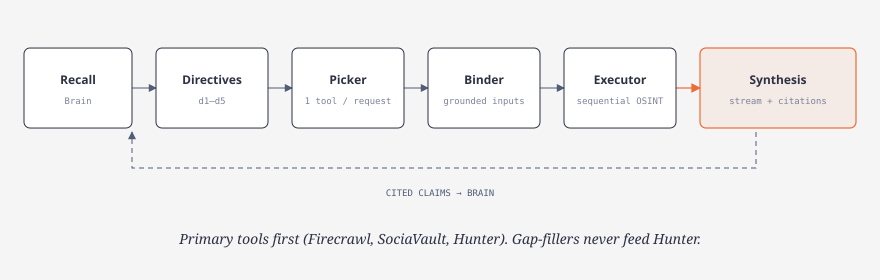
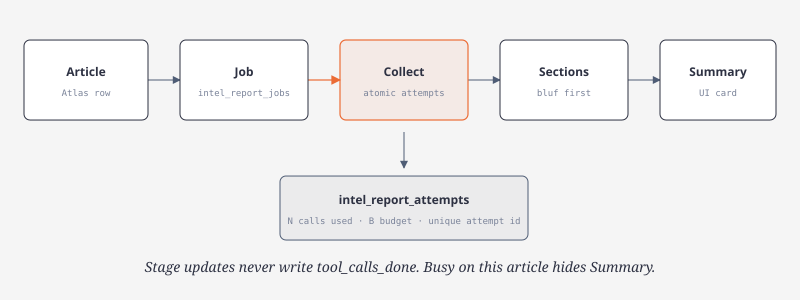
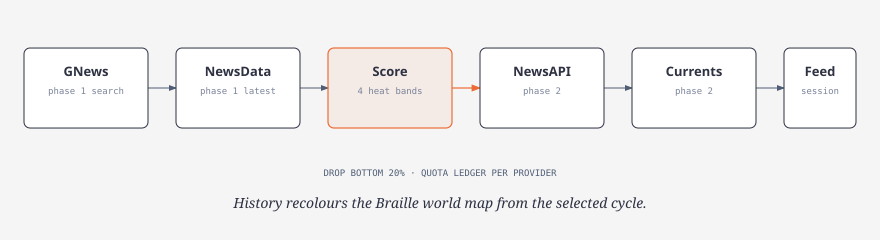
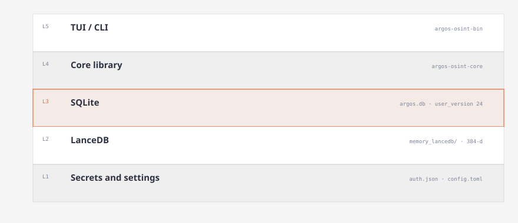

# Usage

How to run the terminal UI and CLI. Product tour in the [README](../README.md). Investigation mechanics in [architecture.md](architecture.md). Keys and model roles in [providers.md](providers.md).

## Terminal UI

```sh
cargo run -p argos-osint-bin
```

Opens on **Home**. `↑↓` + Enter open an app. Keys `1`–`9` jump Intel → Profile. Esc or Home returns Home. `?` opens shortcuts.

[](diagrams/tui-shell.html)

| Keys | Action |
| --- | --- |
| Tab | Next control |
| Ctrl+U / Ctrl+D | Scroll the focused pane |
| Mouse wheel | Scroll the pane under the pointer |
| Ctrl+K | Command palette |
| Ctrl+C | Cancel a running turn, or clear a draft |
| Ctrl+Q | Quit (confirm within one second if work is pending) |

A click commits on mouse-up only if the pointer stays within one cell of the press. Dragging across Home does not launch an app.

### Recon

Full-screen list of recent investigations. Enter opens the transcript. Esc from the transcript returns to the list.

| Keys | Action |
| --- | --- |
| Tab | Transcript ↔ prompt |
| Enter / Shift+Enter | Send / newline |
| `↑↓` / `←→` | Select message · fold decision/tool |
| `f` | Full text |
| Ctrl+N | New investigation |
| Alt+Left / Alt+Right | Cycle threads (cursor not in a field) |

Question on a raised prompt band. Answer is Markdown. Decisions and lookups stay collapsed. `◉ brain` opens memories used in that synthesis. Untitled until Recon names it from the first question. Composer commands: `:rename`, `:delete`, `:delete-with-insights`.

Turn flow, bindings, and citations: [architecture.md](architecture.md).

[](diagrams/recon-turn.html)

### Intel

Atlas headline board: tabs, day filter, search, hero story.

- Enter → Briefing Focus (claims, tags, links, mini-map, Summary)
- View full report → 70%-width card
- Mode button → Verify / Explain / Assess Outlook / Full Assessment (Jobs-backed)
- Busy work on this article hides Summary and the launch control

Details: [concepts.md](concepts.md) · [architecture.md](architecture.md#intel-reports).

[](diagrams/intel-report.html)

### Atlas

Two-phase news cycle:

1. GNews + NewsData, 48 h, score countries
2. NewsAPI + Currents headlines for kept bands

Pause stores a cursor. Resume continues and retries only incomplete packets. History + Braille world map follow the selected cycle (default world view about 1.20× the previous scale). Insights tables wrap to inner width. Incomplete indexing stays **waiting** while background retries continue; optional context failures complete with warnings.

Pipeline and quotas: [architecture.md](architecture.md#atlas).

[](diagrams/atlas-pipeline.html)

### Profile

Two tabs. `Tab` switches them (a bare `Tab` only: `Ctrl+Tab` still cycles apps, `Tab` in a field still moves focus).

| Keys | Action |
| --- | --- |
| `Tab` | Overview ↔ System |
| `1`–`5` | Jump to a section (Intel → Tools) |
| `[` `]` | Previous / next section |
| `j` `k` / `↑` `↓` | Next / previous widget in the focused section |
| `m` | `see more` — grow the focused widget's page |
| `c` | Clear dimension filters (the period stays) |
| `f` | Filter popup, then `n` cycles its dimension (narrow viewports) |
| `r` | Refresh hardware |
| `x` | Configs |
| Esc | Home |

**Overview** is the activity dashboard: a filter strip (period plus the bounded dimensions) above a section navigator, and the focused section's widgets. **System** keeps Host, Paths and Refresh hardware, and adds the **Configs** popup.

**Configs** (`x`) — Export writes the portable schema-v1 document; Import merges one in. The file contains saved API keys, so treat it as a secret and never commit it.

| Tab | Keys |
| --- | --- |
| Export | Type the destination (`~` expands), Enter checks it and exports. Enter again confirms an overwrite |
| Import | Paste the document. Enter inserts a newline; Ctrl+Enter validates and, only when valid, imports |

The redacted change summary lists what moves before you commit. Every surface here — widget ids, the filter strip, the metric dictionary, the portable configuration contract, validation and the commit — is documented in [profile-dashboard-and-search.md](profile-dashboard-and-search.md).

### Other apps

| App | Role |
| --- | --- |
| Brain | Saved memories, Find, Create / Pin / Delete, path graph ([recall](diagrams/brain-recall.html)) |
| Tools (`Osint`) | Manual HTTP tools, keys, documentation, history |
| Models (`Providers`) | Defaults (primary + ordered fallbacks), OpenRouter, Google, Nvidia |
| Jobs | Background work ([lifecycle](diagrams/jobs-lifecycle.html)) |
| Logs | Durable events |
| Profile (`System`) | Activity dashboard, host and storage paths, portable configuration |

Module ids vs labels: [concepts.md](concepts.md). TUI contracts: [conventions.md](conventions.md). Surface audit: [ui-interaction-audit.md](ui-interaction-audit.md).

## CLI

From source: prefix `cargo run -p argos-osint-bin --`. Same store, registry, and executor as the TUI. JSON where practical.

```sh
# Recon
argos recon new --title 'Example investigation'
argos recon list --search example
argos recon show <thread-id>
argos recon ask <thread-id> 'What is known about example.org?'
argos recon ask-new 'What is known about example.org?'
argos recon resume <run-id>
argos recon retry <run-id>
argos recon delete <thread-id> --with-insights

# Tools
argos osint list
argos osint describe shodan_internetdb
argos osint run shodan_internetdb --input '{"ip":"8.8.8.8"}'
argos osint history
argos osint attach <call-id> <thread-id>
argos osint user-agent 'Argos contact@example.com'

# Models
argos defaults show
argos defaults set recon --provider openrouter --model <model-id>
argos defaults set tool-picker --provider openrouter --model typesafe/jev-1.13
argos defaults set synthesis --provider openrouter --model <model-id>
argos models --role recon

# Brain
argos insights --entity example.org
argos remember --app research --conversation thread-123 'A manually saved fact'
argos recall 'What do I know?'
argos memories
argos memories reindex
```

- `recon show` — plan (directives, grounding, bindings, picker records)
- Default delete keeps Brain memories and marks their source deleted; `--with-insights` removes memories owned only by that investigation
- `recon limits` — per-turn budgets (`--max-calls`, provider credits). `--turn-seconds` / `--max-turn-seconds` are hidden and deprecated; they no longer terminate a turn.
- `argos ask` streams to stderr; stdout is final JSON
- Nominatim and SEC need an identifying User-Agent first

## State

State: `~/.argos` (`ARGOS_HOME` overrides).

| Path | Contents |
| --- | --- |
| `argos.db` | SQLite, `user_version` 26, additive migrations |
| `memory_lancedb/` | Brain vectors |
| `config.toml` | Role defaults |
| `auth.json` | Credentials (owner-only on Unix) |

`ARGOS_EMBED=0` skips MiniLM (Jaccard recall).

[](diagrams/persistence.html)

Persistence: [architecture.md](architecture.md#persistence).
